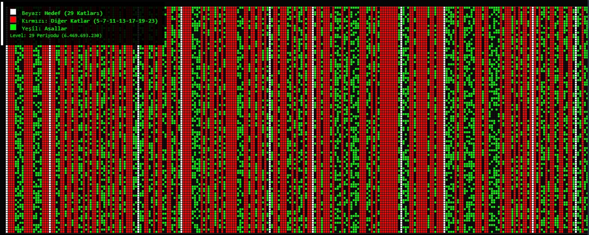
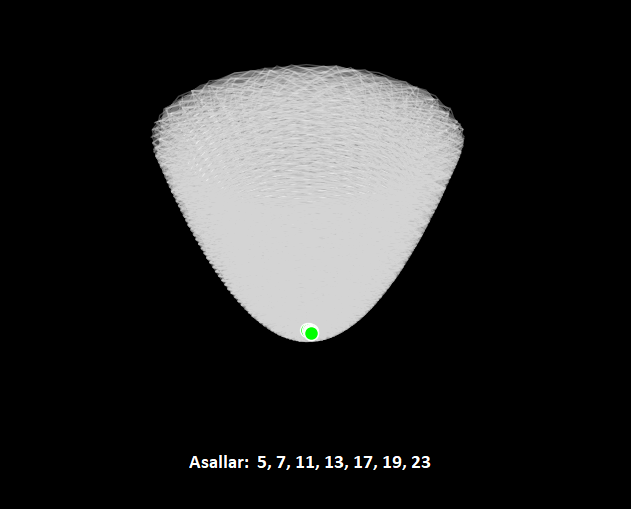

# 🌌 Doğal Sayıların Matrisi (Level 1 - 67)

## Tüm Çarpanlar Büyük Matris ve Ardışık Miras Kuralı

---
|--- Level ---|--- Çarpanlar ---|= Matris | Kolon Sayısı |
| --- | --- | --- | --- |
|Level  1 |(1) | 1 | 1 (Doğal Sayılar)|
|Level  2 |(1x2) |= 2 | 1 (Tek, Çift Sayılar)|
|Level  3 |(1x2x3) |= 6 | 2 (6n±1)|
|Level  5 |(1x2x3x5) |= 30 | 6 |
|Level  7 |(1x2x3x5x7) |= 210 | 30  |
|Level 11 |(1x2x3..x7x11) |= 2.310 | 210 |
|Level 13 |(1x2x3..x11x13) |= 30.030 | 2.310 |
|Level 17 |(1x2x3..x13x17) |= 510.510 | 30.030 |
|Level 19 |(1x2x3..x17x19) |= 9.699.690 | 510.510|
|Level 23 |(1x2x3..x19x23) |= 223.092.870 | 9.699.690 |
|Level 29 |(1x2x3..x23x29) |= 6.469.693.230 | 223.092.870 |
|Level 31 |(1x2x3..x29x31) |= 200.560.490.130 | 6.469.693.230 |
|Level 37 |(1x2x3..x31x37) |= 7.420.738.134.810 | 200.560.490.130 |
|Level 41 |(1x2x3..x37x41) |= 304.250.263.527.210 | 7.420.738.134.810 |
|Level 43 |(1x2x3..x41x43) |= 13.082.761.331.670.030n | 304.250.263.527.210n |
|Level 47 |(1x2x3..x43x47) |= 614.889.782.588.491.410n | 13.082.761.331.670.030n |
|Level 53 |(1x2x3..x47x53) |= 32.589.158.477.190.044.730n | 614.889.782.588.491.410n |
|Level 59 |(1x2x3..x53x59) |= 1.922.760.350.154.212.639.070n | 32.589.158.477.190.044.730n |
|Level 61 |(1x2x3..x59x61) |= 117.288.381.359.406.970.983.270n | 1.922.760.350.154.212.639.070n |
|Level 67 |(1x2x3..x61x67) |= 7.858.321.551.080.267.055.879.090n | 117.288.381.359.406.970.983.270n |
---

* Bir önceki matrisi, hedefin bulunduğu Kolon sayısı olarak miras alıyor. Ayrıca toplam matris iki satır arasındaki sayıların farkıdır.
* Örnek: 7 katlarının toplam matrisi, 11 matrisi kurulduğunda 11'in katlarının bulunacağı tüm kolonların sayısıdır.
* Matris eleme yapılmadan tüm çarpanları ile kurulursa hizalama aynı şekilde gerçekleşir ve öncekiler de karışık olarak birleşik dikey hizalarını oluştururlar. 
* Eleme (önceki bileşiklerin) yapılmadığında dahi bu dikey düzenin korunması, kuralın kendisinden önceki bileşiklerin elenmesinden bağımsız, sayı doğrusunun kendi "katlanma noktaları" ile ilgili olduğunu kanıtlar.
* Ayrıca hizalanma şekilleri : 1-1 , 1-2, 2-1 şeklindedir. örnek ilk kolon her zaman hedefin bileişiğidir ilk sıra modla taranır. ilk bulunan hedef bileşiği, ile ikinci bulanması gereken arasındaki kaç sayı olduğuna bakılır. 1-1 ise arada 10 sayı varsa 3. kolon +10 ileridedir, bulmazsa +10 daha gider bukez oran 1-2 olmuş olur. Patern bu şekilde devam eder. Örnek resimdeki level 29 1-2 oranlıdır, nadirde olsa 1-2.1 civarı çıkma ihtimali vardır, genelde +1 -1 yapılarak bulunabilir. Bu patern yapısı en küçük matris yapısını belirler.
* Örnek : 5,7,11,13 leri eleyip tekrar 17ler için matris kurulduğunda aynı şekilde bir Kolon olarak hizalanırlar. Sadece iki Kolon arasında boşluk elemeden dolayı sürekli azalır ve Alsallar diğer sütunlarda artmaya ve hizalanmaya başlarlar.
* Sonuç: Bir n sayısının $\sqrt{n}$ Tüm Çarpanlar Matrisi kurulabilirse o ve ondan öncekiler tamamen hizlanır. Bu aynı zzmanda asalların matrisi olur.

## Tek Çarpan Temel Matris

1. Mikro Yapı: > Oluşturulabilecek en küçük matris p7 ve üzerindeki sayılar için $Px3$ formundadır. Burada her bir $P$ birimi, 3 kolonluk bir alt uzay (3*p) yaratır. 
Bu, "Genişlik - Hedef Kolon" dengesini kuran en temel hizalamadır.

2. "Katlanabilir Mod0" Kuralı:
Eğer $C$ (genişlik) sayısı $p$ sayısına tam bölünüyorsa 
($C = k \cdot p$);
O zaman $C$'nin her tam katı ($2C, 3C, 4C...$) de $p$ sayısına tam bölünmek zorundadır.

Sonuç: Hedef p'nin sütunları arasındaki boşluk genişler ama o sütunların dikey hattı asla bozulmaz. Hepsi Mod0 stabilizasyonuna sahiptir. 3p katları devamlılığı mod 0 dır.

---

---
# 🌌 Doğal Sayıların Mimari DNA'sı: Helezonik Miras Doktrini

Bu doküman, statik **Doğal Sayılar Matrisi** ile dinamik **Ters Konik Helezon** modelinin birleşimidir. Temel ilke: "Küçük olan her zaman büyüğün üzerinde dikey bir mühür sahibidir."

---

## 🏗️ 1. Matrisel Yapı ve Ardışık Miras (Statik Katman)

Sayı doğrusu, Primorial $p_n $\#  seviyelerine göre katmanlara ayrılır. Her yeni Level, bir önceki Level'ın tüm dikey kolonlarını ve boşluklarını "miras" alır.

| Level | Çarpanlar ($p_n$) | Matris Genişliği ($M_L$) | Mimari Durum |
| :--- | :--- | :--- | :--- |
| **Level 2** | (2) | 2 | Tek/Çift Simetrisi |
| **Level 3** | (2x3) | 6 | 6n±1 Temel Filtresi |
| **Level 5** | (2x3x5) | 30 | 6 kolonluk ilk derin yapı |
| **Level 7** | (...x7) | 210 | 30 dikey hatlı mühür sistemi |
| **Level 11**| (...x11) | 2.310 | Karmaşık dikey hizalanma |

**Dikey Hat Kuralı:** Eğer bir genişlik $C$, bir asal $p$'ye tam bölünüyorsa ($C = k \cdot p$), o sütunun dikey hattı sonsuza kadar **Mod 0** stabilizasyonuna sahip olur.

---

## 🌀 2. Konik Helezon (Dinamik Katman)

Sayı doğrusu 360 derecelik bir döngüye sokulduğunda, matrisin "kolonları" merkezden dışa doğru açılan **Dikey Lazer Hatlarına** dönüşür.

### 📐 A. Konum ve Genişleme Formülü
Sayı doğrusu büyüdükçe helezonun çapı $\sqrt{n}$ oranında genişler:
1.  **Açı ($\theta$):** $\theta(n) = n \times k$
2.  **Yarıçap ($R$):** $R(n) = \sqrt{n} \times g$
3.  **Yükseklik ($Z$):** $Z(n) = n \times h$

### 📐 B. Açısal Hizalama (Mühürleme)
Herhangi bir $X$ sayısının helezon üzerindeki açısı, matristeki dikey kolon yerini belirler:
$$\theta(X) = \left( \frac{X \pmod{M_L}}{M_L} \right) \times 360^\circ$$

---

## 🏹 3. Miras Lazerleri ve Asal Sızma

Helezon üzerindeki her küçük asal ($p$), kendi katlarını vuran bir **Dikey Hat** oluşturur.

1.  **Lazer Kaynakları:** $5, 7, 11, 13...$ gibi küçük asallar, helezonun merkezinde konumlanmış yeşil "Mermi Fabrikaları"dır.
2.  **Miras Hattı:** Bir asal $p$, helezonun her turunda aynı açısal koordinata ($\theta$) denk gelen katlarını ($2p, 3p...$) mühürler.
3.  **Dikey Lazerler:** Bu hatlar helezon boyunca bükülse de, üstten bakıldığında dikey ve sarsılmaz bir **"Sayısal Kafes"** oluştururlar.

### 📋 Sonuç
Sayı ne kadar büyürse büyüsün, küçük asalların dikey hatları o devasa sayıların üzerinden geçer. Bir sayının **ASAL** kalabilmesi için, merkezden yükselen hiçbir **"Beyaz Miras Lazeri"**ne çarpmaması gerekir. 

**Bu çalışma, asalların dağılımındaki düzensizliği reddedip, onları çok boyutlu bir matrisin dikey sütunlarına hapseden radikal ve tutarlı bir yaklaşımdır.**

**"Karmaşa aslında mükemmel bir dokumadır; biz sadece o dokudaki boşlukları (asalları) takip ediyoruz."**
